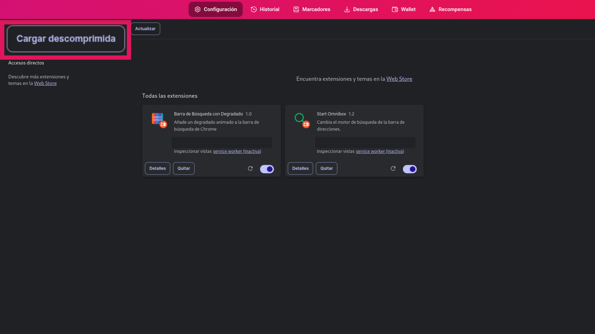
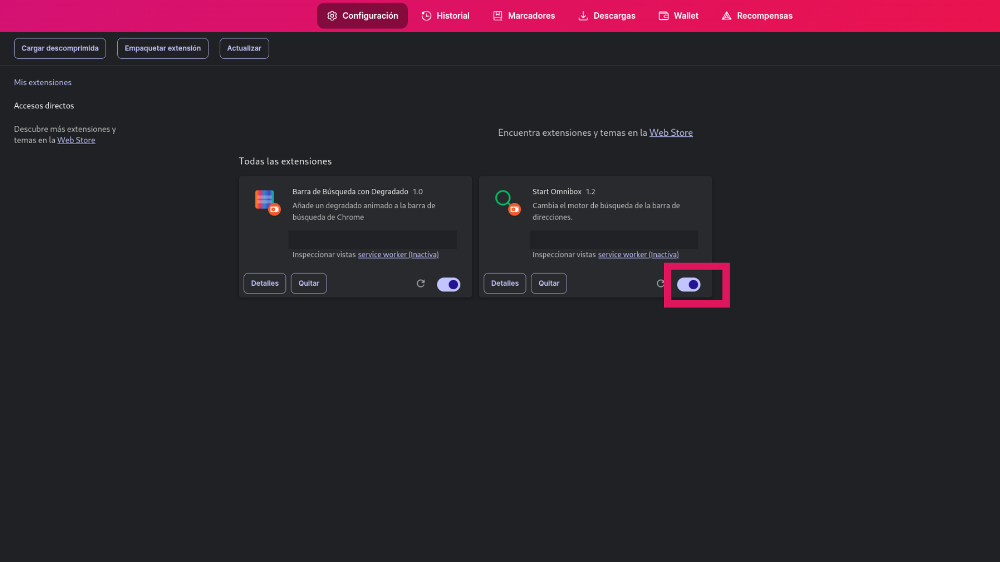

# Start New Tab Chrome
Configure Start como página de inicio, nueva pestaña y arranque
## Instalación
1. Descargue Start New Tab Chrome
2. Abra la sección **Extensiones** de su navegador. En el ejemplo usaremos un navegador basado en Chrome.
3. Arriba a la derecha habilite las funciones de desarrollador.
4. Pulse en **Cargar descomprimida**
5. Luego **active** la extensión. 

## Seguridad
Para garantizar la seguridad de la extensión, al no estar publicada en la Chrome Web Store, puede analizarla con [Virustotal.](https://www.virustotal.com/gui/home/upload)
Desde Inled le garantizamos la máxima seguridad y transparencia.
Puede revisar cada fichero (que son pocos) para verificar que la extensión no daña su dispositivo.

## Reporte de errores
Puede reportar errores desde la sección Issues.